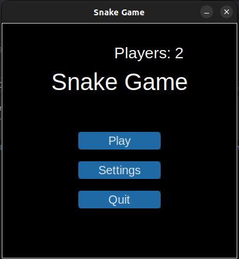
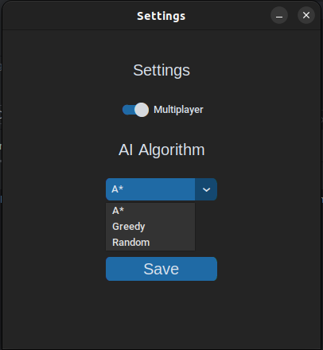
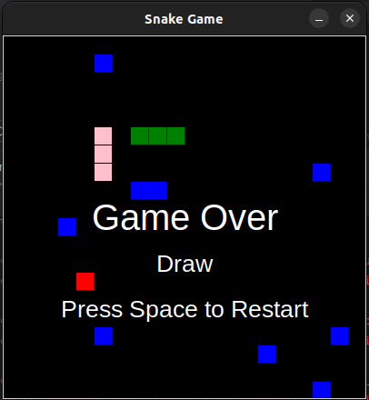

# Snake AI Game Multiplayer

This project is a multiplayer version of the classic Snake game, developed in Python. It includes an AI-controlled enemy
snake for an added level of competition.

## Features

- Multiplayer functionality: Play with your Enemy AI and see who can get the highest score!
- AI Enemy: Compete against an AI-controlled snake that adds an extra layer of challenge to the game.
- Settings: Change the game settings to your liking.
- 

## Installation

1. Clone the repository to your local machine.
2. Navigate to the project directory.
3. Run `python main.py` to start the game.

## Usage

- Use the arrow keys to control your snake.
- Avoid colliding with the AI snake and the game boundaries.
- Eat the food items to increase your score.
- From Setting The Multiplayer Option can be toggled on or off.
- From Setting Enemy Snake Algorithm can be changed to Greedy or A* Algorithm.

## Screenshots

## Built With

- [Python](https://www.python.org/) - Programming language used to develop the game.
- [Tkinter](https://docs.python.org/3/library/tkinter.html) - Python's standard GUI package.
- [Custom Tkinter](https://pypi.org/project/customtkinter/0.3/) - Custom Tkinter widgets.

## Improvements

- [x] Add a main menu.
- [ ] Add a leaderboard to track high scores.
- [ ] Add a pause button.
- [ ] Screen size can be changed.
- [ ] Snake speed can be changed.
- [ ] Other snake colors can be chosen.
- [x] Add a game over screen.
- [ ] Other Snakes Can Be added

[//]: # (## Important Notes)

[//]: # ()
[//]: # (- The game is not compatible with Python 3.9.0 due to a bug in the Custom Tkinter package. Please use Python 3.8.6 or)

[//]: # (  lower.)

## Contributing

Pull requests are welcome. For major changes, please open an issue first to discuss what you would like to change.

## Author

- [JayshKhan](https://github.com/JayshKhan)

## License

[MIT](https://choosealicense.com/licenses/mit/)